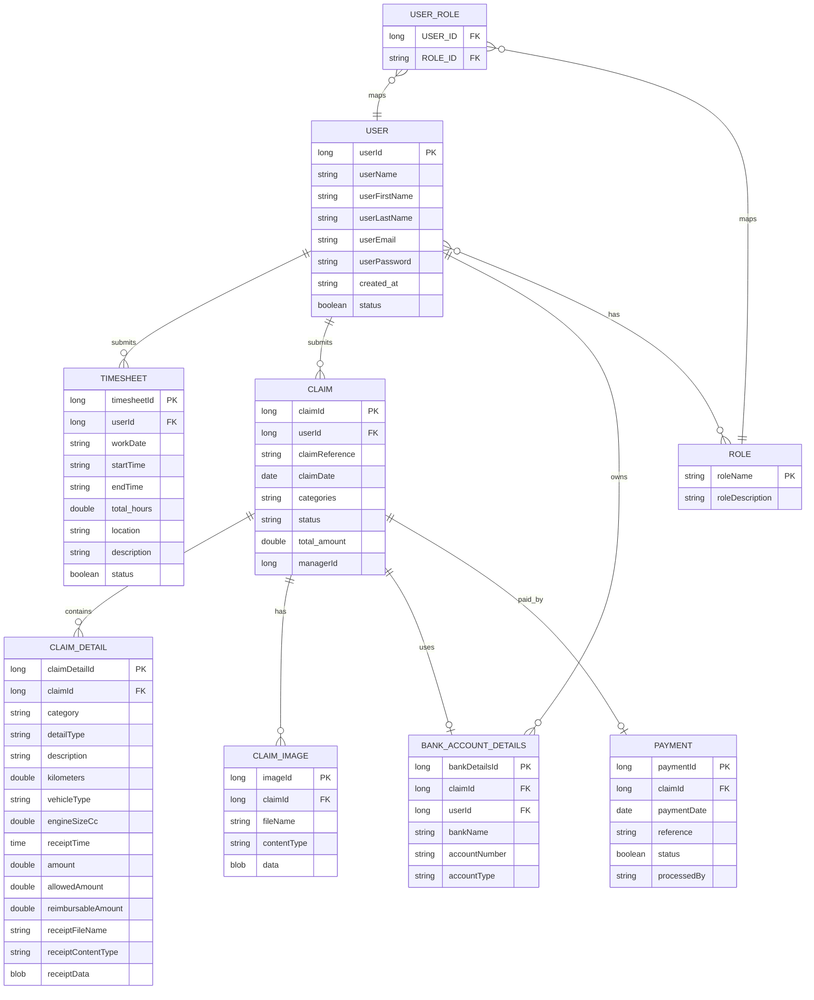
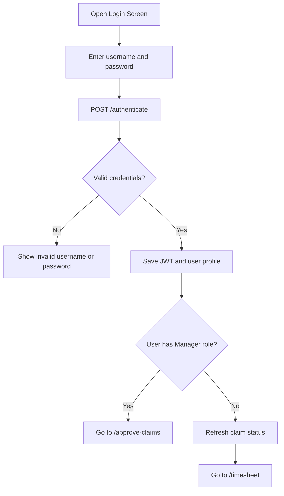
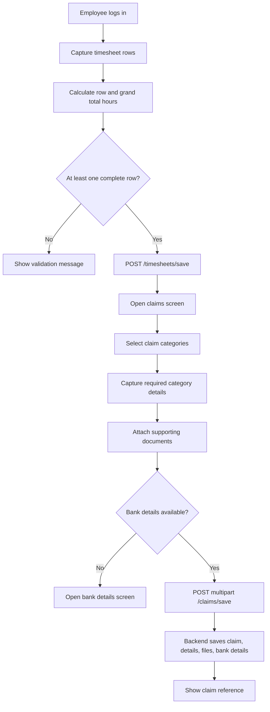
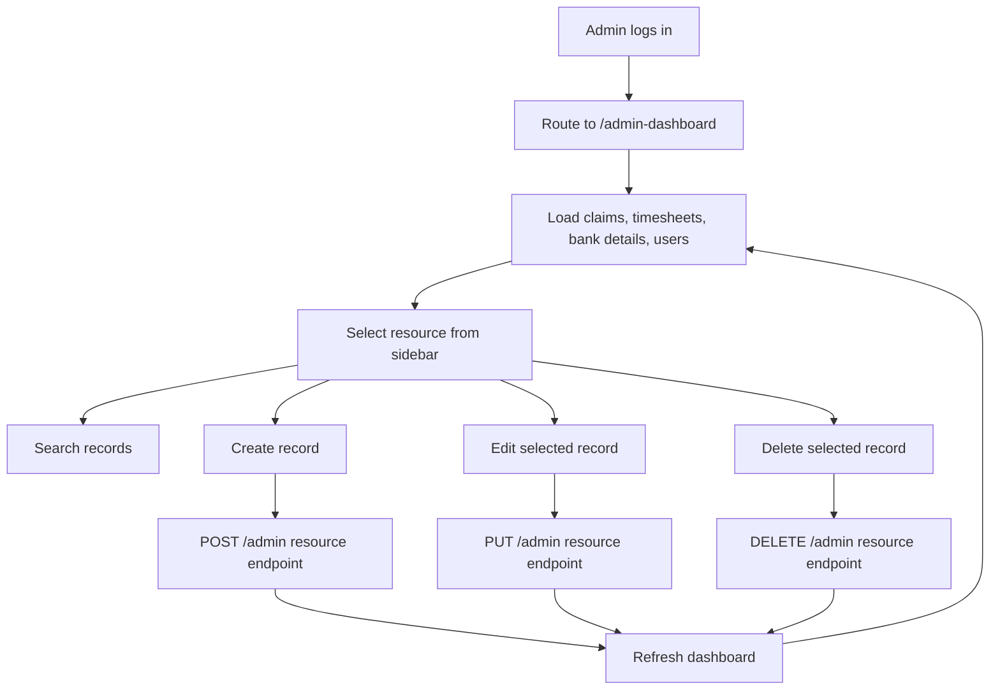
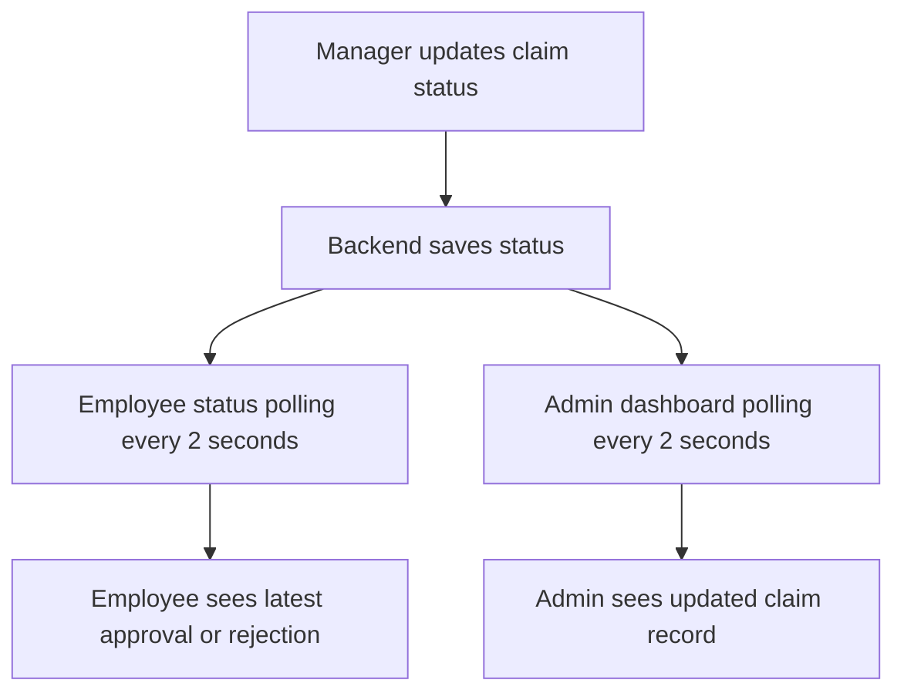

# Business Requirements Document

Project: Travel Worker Timesheet and Expense Claim Management System  
Version: Updated from implemented frontend and backend  
Date: 2026-05-15  
Frontend: `travel_worker_timesheet_expense_claim_management_system_ui`  
Backend: `travel_worker_timesheet_expense_claim_management_backend`

## 1. Purpose

The system enables travelling workers to submit timesheets and travel-related expense claims, enables managers to review, approve, reject, calculate, and pay those claims, and enables administrators to maintain claims, timesheets, and bank detail records. The implemented solution consists of an Angular frontend, a Spring Boot REST API, JWT authentication, Spring Security authorization, and a MySQL database.

## 2. Scope

In scope:

- User login using JWT authentication.
- Role-based routing for employees, managers, and administrators.
- Employee timesheet capture and submission.
- Expense claim capture with categories, claim details, receipts, supporting files, and bank details.
- Claim status tracking for employees.
- Manager claim review, document preview, status update, calculation, and payment processing.
- Admin dashboard for viewing, searching, creating, updating, and deleting claims, timesheets, and bank details.
- Session-based claim draft preservation while users navigate between sidebar screens.
- Periodic status refresh so employee and admin views reflect manager decisions during active sessions.
- Backend storage of users, roles, timesheets, claims, claim details, claim images, bank account details, and payments.

Out of scope:

- Password reset and email notifications.
- Payroll or external banking integration.
- Audit trail beyond saved claim/payment status fields.
- Advanced reporting dashboards beyond operational admin tables.

## 3. Users and Roles

| Role | Description | Main Access |
| --- | --- | --- |
| User | Travelling worker or employee submitting timesheets and claims. | Timesheet, claim submission, bank details, claim status. |
| Manager | Reviewer responsible for approving, rejecting, calculating, and paying claims. | Claim approval dashboard and payment action. |
| Admin | Seeded administrative role responsible for operational record maintenance. | Admin dashboard, all-user claims table, timesheets table, bank details table, search, and CRUD actions. |

Seeded users and roles are created on backend startup when missing:

- `admin123` / `admin@pass` with role `Admin`
- `manager123` / `manager@pass` with role `Manager`
- `user` / `user@123` with role `User`

## 4. Functional Requirements

| ID | Requirement | Implemented Behavior |
| --- | --- | --- |
| FR-001 | Authenticate users. | Users submit username and password to `/authenticate`; backend returns a JWT and user profile. |
| FR-002 | Store user session on frontend. | JWT and user object are saved in browser local storage. |
| FR-003 | Route managers to approvals. | A user with role `Manager` is routed to `/approve-claims` after login. |
| FR-004 | Route employees to timesheets. | Non-admin, non-manager users are routed to `/timesheet` after login. |
| FR-005 | Capture timesheet rows. | Employee captures work date, location, start time, end time, and task description. |
| FR-006 | Calculate timesheet hours. | Frontend calculates row totals and grand total from start/end time. |
| FR-007 | Submit timesheets. | Completed rows are posted to `/timesheets/save` with JWT authorization. |
| FR-008 | Capture bank details. | Employee stores bank name, account number, and account type in local storage for claim submission. |
| FR-009 | Capture claim categories. | Employee can select Meals, Toll Fees, Other, and Distance Travelled. |
| FR-010 | Require claim details. | A selected claim category must have required detail fields before submission. |
| FR-011 | Validate meal time. | Meal claim type must match receipt time: before 12:00 Breakfast, 12:00-15:59 Lunch, 16:00+ Supper. |
| FR-012 | Capture distance details. | Distance Travelled requires kilometers, vehicle type, and engine size in cc. |
| FR-013 | Upload supporting documents. | Claim files are uploaded as multipart files and saved as `ClaimImage` BLOB records. |
| FR-014 | Save detailed receipts. | Claim detail receipt file names are matched to uploaded files and saved as BLOB data when present. |
| FR-015 | Generate claim reference. | Backend generates a unique 10-digit reference using claim date and current time. |
| FR-016 | Default claim status. | New claims default to `Submitted`. |
| FR-017 | Track employee claim status. | Employee status screen refreshes claim status every 2 seconds and on focus/navigation events. |
| FR-018 | List all claims for manager. | Manager dashboard loads all claims from `/claims`. |
| FR-019 | View claim documents. | Manager can request image metadata and retrieve each claim image as a blob. |
| FR-020 | Approve or reject claims. | Manager updates claim status through `/claims/{claimId}/status`. |
| FR-021 | Calculate claim total. | Manager calls `/claims/{claimId}/calculate`; backend sums reimbursable claim detail values. |
| FR-022 | Display bank details during calculation. | Calculation response includes bank details attached to the claim. |
| FR-023 | Process claim payment. | Manager calls `/claims/{claimId}/pay`; backend creates a `Payment` and marks claim as `Paid`. |
| FR-024 | Protect API endpoints. | Most endpoints require JWT; `/authenticate`, `/registerNewUser`, GET `/claims/**`, and OPTIONS requests are permitted. |
| FR-025 | Route admins to admin dashboard. | A user with role `Admin` is routed to `/admin-dashboard` after login. |
| FR-026 | View all operational records as admin. | Admin can view claims, timesheets, and bank details for all users. |
| FR-027 | Search admin records. | Admin can search table records by values such as user, reference, status, bank, date, and IDs. |
| FR-028 | Maintain claims as admin. | Admin can create, update, and delete claim records through `/admin/claims`. |
| FR-029 | Maintain timesheets as admin. | Admin can create, update, and delete timesheet records through `/admin/timesheets`. |
| FR-030 | Maintain bank details as admin. | Admin can create, update, and delete bank detail records through `/admin/bank-details`. |
| FR-031 | Preserve in-progress claim draft. | The claim form keeps selected categories, date, details, and attached files when the employee navigates to bank details, timesheet, or status screens during the same SPA session. |
| FR-032 | Refresh employee claim status during session. | Employee claim status is refreshed every 2 seconds while the user session is active. |
| FR-033 | Refresh admin dashboard during session. | Admin dashboard records are refreshed every 2 seconds so manager approval/rejection changes are reflected without manual refresh. |
| FR-034 | Remove unsupported signup UI. | The login screen no longer displays a sign-up link because registration is not implemented in the frontend. |

## 5. Non-Functional Requirements

| ID | Requirement | Current Implementation |
| --- | --- | --- |
| NFR-001 | Security | JWT authentication, BCrypt password encoding, stateless Spring Security sessions. |
| NFR-002 | Data persistence | MySQL database `travelworker`; Hibernate `ddl-auto=update`. |
| NFR-003 | Cross-origin access | Backend allows all origins, methods GET/POST/PUT/DELETE/OPTIONS, and all headers. |
| NFR-004 | Usability | Angular Material controls are used for forms, dialogs, lists, and date/time inputs. |
| NFR-005 | Responsiveness | Screens include responsive CSS for smaller viewports. |
| NFR-006 | File storage | Uploaded images and receipts are stored in database BLOB columns. |
| NFR-007 | Availability | Local development assumes backend at `http://localhost:8080` and Angular app at `ng serve` default port. |
| NFR-008 | Near real-time updates | Active employee and admin screens use lightweight polling every 2 seconds to reflect manager decisions. |
| NFR-009 | Session continuity | In-progress claim data is retained in Angular service memory while the browser session remains active and the user does not log out. |

## 6. Frontend Screens

| Route | Screen | Main Functions |
| --- | --- | --- |
| `/` | Login | Capture username/password, authenticate, save JWT/user, route by role. |
| `/timesheet` | Timesheet | Capture rows, calculate hours, submit timesheet, navigate to claims/status. |
| `/claims` | Claims | Select categories, capture details, attach files, validate bank details, submit claim. |
| `/bank-details` | Bank Details | Capture and locally save bank name, account number, and account type. |
| `/claim-status` | Claim Status | Display submitted, approved, and rejected claims for the employee. |
| `/approve-claims` | Approve Claims | List all claims, view documents, calculate totals, approve/reject, process payment. |
| `/admin-dashboard` | Admin Dashboard | Admin view of claims, timesheets, and bank details; search; create; update; delete; refresh. |

## 7. Data Models and Entities

### 7.1 Backend Entities

#### User

| Field | Type | Notes |
| --- | --- | --- |
| userId | Long | Primary key, auto generated. |
| userName | String | Login username. |
| userFirstName | String | First name. |
| userLastName | String | Last name. |
| userEmail | String | Email address. |
| userPassword | String | BCrypt encoded password. |
| role | Set<Role> | Many-to-many through `USER_ROLE`. |
| created_at | String | Created date/time string. |
| status | boolean | Active/inactive flag. |

#### Role

| Field | Type | Notes |
| --- | --- | --- |
| roleName | String | Primary key, examples: Admin, Manager, User. |
| roleDescription | String | Role description. |

#### Timesheet

| Field | Type | Notes |
| --- | --- | --- |
| timesheetId | Long | Primary key, auto generated. |
| userId | Long | References employee user. |
| workDate | String | Date worked, submitted as ISO string. |
| startTime | String | Start time/date value. |
| endTime | String | End time/date value. |
| total_hours | Double | Calculated hours for the row. |
| location | String | Work location. |
| description | String | Task description. |
| status | Boolean | Submission/status flag. |

#### Claim

| Field | Type | Notes |
| --- | --- | --- |
| claimId | Long | Primary key, auto generated. |
| userId | Long | Employee user id. |
| claimReference | String | Generated unique reference. |
| claimDate | Date | Date claim was issued. |
| categories | String | Comma-separated selected categories. |
| claimImages | List<String> | Element collection of uploaded file names. |
| status | String | Submitted, Approved, Rejected, Paid. |
| total_amount | Double | Calculated total. |
| managerId | Long | Manager identifier if used. |
| userName | String | Transient display field. |
| userSubmissionCount | Long | Transient count field. |

#### ClaimDetail

| Field | Type | Notes |
| --- | --- | --- |
| claimDetailId | Long | Primary key, auto generated. |
| claimId | Long | Parent claim id. |
| category | String | Meals, Toll Fees, Other, Distance Travelled. |
| detailType | String | Meal type or Distance. |
| description | String | Description for Other and supporting detail. |
| kilometers | Double | Distance travelled. |
| vehicleType | String | Petrol or Diesel. |
| engineSizeCc | Double | Engine size used for rate. |
| receiptTime | LocalTime | Used for meal classification. |
| amount | Double | Claimed amount. |
| allowedAmount | Double | Meal allowance reference amount. |
| reimbursableAmount | Double | Normalized reimbursement value. |
| receiptFileName | String | Uploaded receipt file name. |
| receiptContentType | String | Receipt MIME type. |
| receiptData | byte[] | Receipt BLOB. |
| receiptUrl | String | Transient URL for receipt download/view. |

#### ClaimImage

| Field | Type | Notes |
| --- | --- | --- |
| imageId | Long | Primary key, auto generated. |
| claimId | Long | Parent claim id. |
| fileName | String | Original uploaded file name. |
| contentType | String | MIME type. |
| data | byte[] | File BLOB. |

#### BankAccountDetails

| Field | Type | Notes |
| --- | --- | --- |
| bankDetailsId | Long | Primary key, auto generated. |
| claimId | Long | Claim id. |
| userId | Long | Employee user id. |
| bankName | String | Bank name. |
| accountNumber | String | Account number. |
| accountType | String | Cheque, Savings, or Transmission. |

#### Payment

| Field | Type | Notes |
| --- | --- | --- |
| paymentId | Long | Primary key, auto generated. |
| claimId | Long | Paid claim id. |
| paymentDate | Date | Payment processing date. |
| reference | String | `PAY-` plus claim reference or claim id. |
| status | Boolean | True when payment processed. |
| processedBy | String | Manager/processor name. |

### 7.2 API DTOs and Response Models

| Model | Fields |
| --- | --- |
| JwtRequest | userName, userPassword |
| JwtResponse | user, jwtToken |
| ClaimImageResponse | imageId, fileName, contentType, imageUrl |
| ClaimCalculationResponse | claimId, claimReference, claimDate, totalAmount, details, bankDetails |
| UserClaimCountResponse | userSubmissionCount |
| PaymentResponse | paymentId, claimId, paymentDate, reference, status, processedBy |

## 8. Business Rules

### 8.1 Claim Status Rules

- New claims are saved as `Submitted`.
- Manager may update status to `Approved` or `Rejected`.
- Payment processing changes claim status to `Paid`.
- Employee status screen treats missing, boolean `true`, or empty status as `Submitted`.

### 8.2 Meal Rules

| Receipt Time | Meal Type | Allowed Amount |
| --- | --- | --- |
| Before 12:00 | Breakfast | R150.00 |
| 12:00 to 15:59 | Lunch | R190.00 |
| 16:00 and later | Supper | R210.00 |

Frontend validation requires the selected meal type to match the receipt time. Backend normalizes the meal type and allowance from the submitted receipt time.

### 8.3 Distance Rate Rules

Petrol reimbursement rates:

| Engine Size | Rate per km |
| --- | --- |
| <= 1250 cc | R3.172 |
| <= 1550 cc | R3.992 |
| <= 1750 cc | R4.337 |
| <= 1950 cc | R4.999 |
| <= 2150 cc | R5.359 |
| <= 2500 cc | R6.068 |
| <= 3500 cc | R7.576 |
| > 3500 cc | R8.952 |

Diesel reimbursement rates:

| Engine Size | Rate per km |
| --- | --- |
| <= 1250 cc | R3.197 |
| <= 1550 cc | R3.828 |
| <= 1750 cc | R4.248 |
| <= 1950 cc | R4.448 |
| <= 2150 cc | R5.196 |
| <= 2500 cc | R5.942 |
| > 2500 cc | R7.375 |

Distance amount = kilometers multiplied by the rate determined by vehicle type and engine size.

### 8.4 Calculation Rules

- Distance Travelled: included amount is kilometers multiplied by applicable fuel/engine rate.
- Meals: included amount is the submitted amount.
- Toll Fees: included amount is the submitted amount.
- Other: included amount is the submitted amount.
- The calculated claim total is saved to `Claim.total_amount`.

## 9. Use Cases

### UC-001 Login

Actor: User, Manager, Admin  
Preconditions: Account exists and is active.  
Main flow:

1. Actor opens login screen.
2. Actor enters username and password.
3. Frontend posts credentials to `/authenticate`.
4. Backend validates credentials and returns JWT plus user profile.
5. Frontend stores JWT and user profile.
6. Manager is redirected to approvals; other users are redirected to timesheet.

### UC-002 Submit Timesheet

Actor: User  
Preconditions: User is logged in.  
Main flow:

1. User opens timesheet screen.
2. User enters work date, location, start time, end time, and task description.
3. Frontend calculates total hours per row and grand total.
4. User submits completed rows.
5. Frontend posts rows to `/timesheets/save`.
6. Backend saves timesheets.
7. User is routed to claims screen.

### UC-003 Capture Bank Details

Actor: User  
Preconditions: User is logged in.  
Main flow:

1. User opens bank details screen.
2. User enters bank name, account number, and account type.
3. Frontend validates required fields.
4. Frontend stores bank details locally for the next claim submission.

### UC-004 Submit Claim

Actor: User  
Preconditions: User is logged in and bank details are captured.  
Main flow:

1. User opens claims screen.
2. User selects one or more claim categories.
3. User captures required category detail.
4. User attaches supporting documents or receipts.
5. Frontend validates selected categories and bank details.
6. Frontend posts a multipart request to `/claims/save`.
7. Backend saves claim, files, details, bank details, and generated reference.
8. Frontend displays confirmation with claim reference.

### UC-005 Track Claim Status

Actor: User  
Preconditions: User has submitted one or more claims.  
Main flow:

1. User opens claim status screen.
2. Frontend refreshes user claims from `/claims/user/{userId}` and count from `/claims/user/{userId}/count`.
3. Screen displays submitted, approved, and rejected claims.
4. Screen refreshes periodically and when browser focus returns.

### UC-006 Review and Decide Claim

Actor: Manager  
Preconditions: Manager is logged in.  
Main flow:

1. Manager opens approve claims screen.
2. Frontend loads claims from `/claims`.
3. Manager views claim fields and supporting documents.
4. Manager approves or rejects a claim.
5. Frontend sends status update to `/claims/{claimId}/status`.
6. Backend saves the new status.

### UC-007 Calculate and Pay Claim

Actor: Manager  
Preconditions: Claim exists and has claim details.  
Main flow:

1. Manager selects Calculate on a claim.
2. Frontend calls `/claims/{claimId}/calculate`.
3. Backend calculates total amount and returns details plus bank details.
4. Manager reviews calculation and selects Pay.
5. Frontend posts processor name to `/claims/{claimId}/pay`.
6. Backend creates payment record and marks claim as Paid.

### UC-008 Admin Maintain Operational Records

Actor: Admin  
Preconditions: Admin is logged in with role `Admin`.  
Main flow:

1. Admin logs in with admin credentials.
2. Frontend routes the admin to `/admin-dashboard`.
3. Admin selects Claims, Timesheets, or Bank Details from the sidebar.
4. Admin searches records when the table has many rows.
5. Admin creates, edits, or deletes a selected record.
6. Backend persists changes through `/admin/**` endpoints.
7. Admin dashboard refreshes every 2 seconds so manager claim decisions appear during the active session.

### UC-009 Preserve Claim Draft Across Sidebar Navigation

Actor: User  
Preconditions: User is logged in and has started a claim.  
Main flow:

1. User selects claim categories, enters details, attaches receipts, or changes the claim date.
2. User navigates to Bank Details, Timesheet, or Status from the sidebar.
3. Frontend stores the in-progress claim draft in the Angular claim service.
4. User returns to Claims.
5. Previously selected categories, details, attachments, and date remain available during the same SPA session.

### UC-010 Concurrent Claim Status Visibility

Actor: User, Admin  
Preconditions: Manager changes a claim status while user/admin screens are active.  
Main flow:

1. Manager approves or rejects a claim.
2. Backend persists the new claim status.
3. Employee claim status polling refreshes within approximately 2 seconds.
4. Admin dashboard polling refreshes within approximately 2 seconds.
5. The updated status appears without manual refresh.

## 10. Suggested API Endpoints

Base URL: `http://localhost:8080`

| Method | Endpoint | Purpose | Auth |
| --- | --- | --- | --- |
| POST | `/authenticate` | Login and receive JWT. | Public |
| POST | `/registerNewUser` | Register a new user with User role. | Public |
| POST | `/createNewRole` | Create a role. | JWT |
| GET | `/admin/users` | List users for admin display names and IDs. | Admin |
| GET | `/admin/claims` | List all claims for admin. | Admin |
| POST | `/admin/claims` | Create a claim record. | Admin |
| PUT | `/admin/claims/{claimId}` | Update a claim record. | Admin |
| DELETE | `/admin/claims/{claimId}` | Delete a claim and linked details/images/bank/payment records. | Admin |
| GET | `/admin/timesheets` | List all timesheets. | Admin |
| POST | `/admin/timesheets` | Create a timesheet record. | Admin |
| PUT | `/admin/timesheets/{timesheetId}` | Update a timesheet record. | Admin |
| DELETE | `/admin/timesheets/{timesheetId}` | Delete a timesheet record. | Admin |
| GET | `/admin/bank-details` | List all bank detail records. | Admin |
| POST | `/admin/bank-details` | Create a bank detail record. | Admin |
| PUT | `/admin/bank-details/{bankDetailsId}` | Update a bank detail record. | Admin |
| DELETE | `/admin/bank-details/{bankDetailsId}` | Delete a bank detail record. | Admin |
| GET | `/forAdmin` | Admin-only protected test endpoint. | Admin |
| GET | `/forUser` | User-only protected test endpoint. | User |
| POST | `/timesheets/save` | Save submitted timesheet rows. | JWT |
| GET | `/timesheets` | List all timesheets. | JWT |
| POST | `/claims/save` | Save claim as multipart form data. | JWT |
| GET | `/claims` | List all claims. | Public in current security config |
| GET | `/claims/user/{userId}` | List claims for one user. | Public in current security config |
| GET | `/claims/user/{userId}/count` | Count claims for one user. | Public in current security config |
| GET | `/claims/{claimId}/images` | Get claim image metadata. | Public in current security config |
| GET | `/claims/{claimId}/images/{imageId}` | Get image BLOB. | Public in current security config |
| GET | `/claims/{claimId}/details` | Get claim details. | Public in current security config |
| GET | `/claims/{claimId}/details/{detailId}/receipt` | Get claim detail receipt BLOB. | Public in current security config |
| GET | `/claims/{claimId}/calculate` | Calculate and persist claim total. | Public in current security config |
| PUT | `/claims/{claimId}/status` | Update claim status. | JWT |
| POST | `/claims/{claimId}/pay` | Create payment and mark claim Paid. | JWT |

Recommended future endpoint hardening:

- Restrict GET `/claims/**` to authenticated users.
- Restrict manager-only actions such as status updates, calculation, and payment to role `Manager`.
- Add user ownership checks for employee claim status endpoints.
- Add CRUD endpoints for bank details if bank details should persist independently before claim submission.

## 11. ERD



## 12. Process Flow Diagrams

### 12.1 Authentication and Routing



### 12.2 Employee Timesheet and Claim Submission



### 12.3 Manager Approval, Calculation, and Payment

```mermaid
flowchart TD
    A[Manager logs in] --> B[Load all claims]
    B --> C[Review claim list]
    C --> D[View documents]
    C --> E[Approve or reject]
    E --> F[PUT /claims/{claimId}/status]
    C --> G[Calculate claim]
    G --> H[GET /claims/{claimId}/calculate]
    H --> I[Show details, bank details, total]
    I --> J[Process payment]
    J --> K[POST /claims/{claimId}/pay]
    K --> L[Create Payment and mark claim Paid]
```


### 12.4 Admin Dashboard Maintenance



### 12.5 Active Session Refresh



## 13. Test Scenarios

| ID | Scenario | Expected Result |
| --- | --- | --- |
| TS-001 | Login with valid employee credentials. | JWT and user are saved; employee is routed to `/timesheet`. |
| TS-002 | Login with valid manager credentials. | JWT and user are saved; manager is routed to `/approve-claims`. |
| TS-003 | Login with invalid credentials. | Error message `Invalid username or password` is shown. |
| TS-004 | Submit timesheet without login. | Error message asks user to log in. |
| TS-005 | Submit timesheet with no complete rows. | Validation message asks for at least one row. |
| TS-006 | Enter end time before start time. | Row total displays `Invalid`; invalid total is excluded from grand total. |
| TS-007 | Submit a valid timesheet row. | Backend saves row and frontend navigates to claims screen. |
| TS-008 | Save blank bank details. | Validation requires bank name, account number, and account type. |
| TS-009 | Save complete bank details. | Details are stored locally and success message is shown. |
| TS-010 | Submit claim without category. | Validation asks user to select at least one claim category. |
| TS-011 | Submit claim without bank details. | Validation asks user to capture bank details before submission. |
| TS-012 | Select Meals without detail. | Detail dialog opens before submission. |
| TS-013 | Select Breakfast with receipt time 13:00. | Frontend blocks save and says slip time is treated as Lunch. |
| TS-014 | Submit Distance Travelled without kilometers. | Category remains incomplete and submission is blocked. |
| TS-015 | Submit valid claim with files and bank details. | Backend saves claim, generated reference is returned, confirmation dialog appears. |
| TS-016 | Manager loads approvals. | All claims are displayed or an error appears if unavailable. |
| TS-017 | Manager views claim images. | Image metadata loads and BLOB previews are created. |
| TS-018 | Manager approves a claim. | Claim status changes to Approved and persists on backend. |
| TS-019 | Manager rejects a claim. | Claim status changes to Rejected and persists on backend. |
| TS-020 | Employee opens status screen after approval. | Approved claim appears with approved status/icon. |
| TS-021 | Calculate claim with Meals detail. | Total includes submitted meal amount. |
| TS-022 | Calculate claim with Toll Fees detail. | Total includes submitted toll amount. |
| TS-023 | Calculate claim with Other detail. | Total includes submitted other amount. |
| TS-024 | Calculate petrol distance claim. | Total equals kilometers multiplied by petrol cc rate. |
| TS-025 | Calculate diesel distance claim. | Total equals kilometers multiplied by diesel cc rate. |
| TS-026 | Pay a calculated claim. | Payment is saved, reference starts with `PAY-`, claim status becomes Paid. |
| TS-027 | Access protected POST without JWT. | Backend returns unauthorized response. |
| TS-028 | Register a new user. | User is saved with encoded password and User role. |
| TS-029 | Login with valid admin credentials. | JWT and user are saved; admin is routed to `/admin-dashboard`. |
| TS-030 | Admin searches records. | Table filters to matching claims, timesheets, or bank details. |
| TS-031 | Admin creates a claim. | Claim record is saved through `/admin/claims` and appears in the claims table. |
| TS-032 | Admin updates a timesheet. | Timesheet changes persist through `/admin/timesheets/{timesheetId}`. |
| TS-033 | Admin deletes bank details. | Bank detail record is removed through `/admin/bank-details/{bankDetailsId}`. |
| TS-034 | User navigates from Claims to Bank Details and back. | In-progress claim categories, details, date, and files remain in the claim form. |
| TS-035 | Manager approves claim while employee status screen is open. | Employee status updates within the active polling interval. |
| TS-036 | Manager rejects claim while admin dashboard is open. | Admin claims table updates within the active polling interval. |
| TS-037 | Login screen is displayed. | No sign-up section or sign-up route link is shown. |

## 14. Assumptions and Open Items

- The previous PDF could not be extracted in this environment because no local PDF text extraction tool or Python PDF library is installed.
- The current backend permits GET access to `/claims/**`; this is useful during development but should be restricted for production.
- Bank details are saved in browser local storage until a claim is submitted, then persisted with that claim.
- No frontend registration screen exists although `/registerNewUser` exists on the backend; the login sign-up link has been removed.
- No Angular route guard is implemented; routing checks are handled inside components.
- Existing unit test files are mostly generated skeletons and should be expanded around the scenarios listed above.

